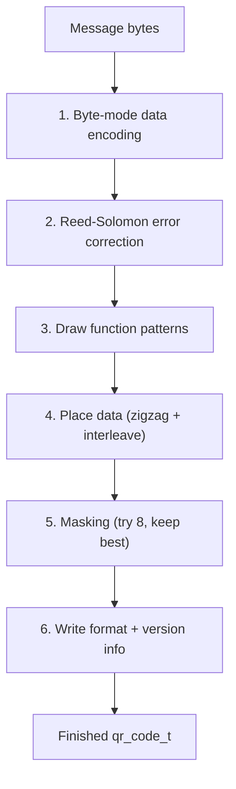

# QR Code Generator — Technical Manual

*A minimal-RAM, byte-mode QR Code encoder in portable C99, with a Windows console demo.*

This manual documents `qrcode.c` / `qrcode.h` (the encoder library) and
`main.c` (the Visual Studio console demo built on top of it). It's meant
to be read either front-to-back or dipped into as a reference — use the
table of contents to jump straight to what you need.

---

## Table of Contents

1. [Introduction](#1-introduction)
2. [Quick Start Guide](#2-quick-start-guide)
3. [QR Code Concepts](#3-qr-code-concepts)
4. [How the Encoder Works](#4-how-the-encoder-works)
5. [How the Console Demo Works](#5-how-the-console-demo-works)
6. [Memory Usage Reference](#6-memory-usage-reference)
7. [Configuration Reference](#7-configuration-reference)
8. [API Reference](#8-api-reference)
9. [Limitations](#9-limitations)
10. [Putting an Image in the Center of a QR Code](#10-putting-an-image-in-the-center-of-a-qr-code)
11. [Extending Beyond Version 20](#11-extending-beyond-version-20)
12. [Troubleshooting / FAQ](#12-troubleshooting--faq)
13. [Testing and Validation](#13-testing-and-validation)
14. [Glossary](#14-glossary)
15. [References and Further Reading](#15-references-and-further-reading)

---

## 1. Introduction

### 1.1 What this project is

This is a QR Code symbol encoder written from scratch in portable C99,
originally designed for 8-bit microcontrollers where RAM is the scarce
resource. Every design decision in `qrcode.c`/`qrcode.h` follows from
that goal:

- Only **byte (binary) mode** encoding is implemented — no
  numeric/alphanumeric/kanji modes, which exist purely to pack more
  characters into restricted alphabets and aren't needed for a general
  encoder.
- The **QR version and error correction level are build-time
  constants**, not runtime parameters. Nothing about the symbol's
  structure is decided while the program is running, so no RAM is
  spent storing settings that never change after compilation.
- Reed–Solomon error correction uses a **table-free GF(256)
  multiplication** routine instead of the usual 512 bytes of
  log/antilog lookup tables.
- The interleaved final codeword stream is generated **on the fly**
  instead of being built into a second buffer.
- All internal working buffers are `static`, not stack-allocated, so a
  generously-sized QR version won't overflow a tiny microcontroller
  call stack.

None of this is Windows-specific — you can drop `qrcode.c`/`qrcode.h`
into an AVR, ARM Cortex-M, or any other C99 toolchain's project
unchanged. The Visual Studio console app in this repository
(`main.c`) is simply one example consumer of the library, useful for
trying it out and seeing scannable output on a normal PC before
deploying to real hardware.

### 1.2 What's in this manual

This manual explains, in order: how to get the demo running (Chapter
2), background on what a QR code actually contains (Chapter 3), a
step-by-step walkthrough of exactly what the encoder does to turn a
message into a grid of modules (Chapter 4), how the console demo turns
that grid into on-screen output (Chapter 5), precise memory figures
for every version and error-correction level (Chapter 6), every
compile-time setting (Chapter 7), the public function/type reference
(Chapter 8), what's deliberately *not* supported (Chapter 9), how
much of a symbol can safely be covered by a logo in the center
(Chapter 10), how to go beyond the shipped limits (Chapter 11),
common problems and fixes (Chapter 12), how this was validated
(Chapter 13), a glossary of QR terminology (Chapter 14), and pointers
to the source material this was built from (Chapter 15).

### 1.3 Project components

| File | What it is |
|---|---|
| `qrcode.h` | Public API and build-time configuration (`QR_VERSION`, `QR_ECC_LEVEL`, `QR_FIXED_MASK`). Read this first if you're integrating the library elsewhere. |
| `qrcode.c` | The encoder itself. Self-contained; the only dependency is `<string.h>` for `memset`/`memcpy`. |
| `main.c` | The Windows console demo: prompts for a message, calls into `qrcode.c`, and renders the result. |
| `QrConsoleApp.vcxproj` / `.sln` | The Visual Studio project wrapping all three of the above into one executable. |

---

## 2. Quick Start Guide

### 2.1 Prerequisites

- Visual Studio 2022 or newer, with the **"Desktop development with
  C++"** workload installed (that's the component that provides
  `cl.exe` and native project templates — there's no separate "C"
  workload; plain C projects use the same one as C++).

### 2.2 Open, build, run

1. Open `QrConsoleApp.sln`.
2. Pick a configuration (**Debug|x64** or **Release|x64**) from the
   toolbar.
3. Press **F5** (Start Debugging) or **Ctrl+F5** (Start Without
   Debugging).
4. Type a message at the prompt and press Enter.

You'll see the version/level/size printed, then the symbol twice: once
"full size" and once "half size" (see [Chapter 5](#5-how-the-console-demo-works)
for what that means). Both are genuinely scannable with a phone camera
directly off the screen — that's the whole point of the quiet zone and
white background around them.

You can also pass the message as a command-line argument instead of
being prompted (Project Properties → Debugging → Command Arguments, or
from an existing console: `QrConsoleApp.exe "https://example.com"`).

### 2.3 Changing what gets encoded

The message is the only thing this program reads at run time — type
whatever you like. If it doesn't fit the compiled-in version/level's
capacity, `qr_generate()` returns `false` and the app prints a clear
error instead of doing anything undefined; see
[Section 6.4](#64-data-capacity-by-version-and-ec-level) for exactly
how many bytes fit where.

### 2.4 Changing the QR version or error-correction level

These are compile-time settings (Project Properties → C/C++ →
Preprocessor → Preprocessor Definitions):

```
QR_VERSION=6
QR_ECC_LEVEL=QR_ECC_M
```

Edit both the Debug and Release configurations if you use both, then
rebuild. See [Chapter 7](#7-configuration-reference) for what every
setting does and [Chapter 6](#6-memory-usage-reference) for how your
choice affects memory use.

### 2.5 Using the library outside this demo

Drop `qrcode.h` and `qrcode.c` into any C99 project, define
`QR_VERSION`/`QR_ECC_LEVEL` (either with `#define` before including the
header, or as compiler `-D` flags / preprocessor definitions), and
call two functions:

```c
#define QR_VERSION 4
#define QR_ECC_LEVEL QR_ECC_M
#include "qrcode.h"

qr_code_t qr;
const char *msg = "https://example.com";
if (qr_generate(&qr, (const uint8_t *)msg, strlen(msg))) {
    for (int y = 0; y < QR_SIZE; y++) {
        for (int x = 0; x < QR_SIZE; x++) {
            bool dark = qr_get_module(&qr, x, y);
            /* draw `dark` at (x, y) however your platform does that */
        }
    }
}
```

That's the entire API — two functions, one struct.

---

## 3. QR Code Concepts

If you already know how QR codes are structured, skip to
[Chapter 4](#4-how-the-encoder-works). If not, this section gives just
enough background to make the rest of the manual make sense.

### 3.1 Anatomy of a QR symbol

A QR symbol is a square grid of black/white **modules**. Most of that
grid carries your data, but a fixed set of positions are reserved for
structural patterns the scanner uses to find and read the symbol:

| Feature | Purpose |
|---|---|
| **Finder patterns** | Three identical 7×7 targets in the top-left, top-right, and bottom-left corners, surrounded by a 1-module light **separator**. Let a scanner locate and orient the symbol at almost any rotation. |
| **Timing patterns** | Alternating dark/light single-module lines connecting the finder patterns, one horizontal and one vertical. Let the scanner count modules accurately even if the image is slightly distorted. |
| **Alignment patterns** | Smaller 5×5 targets scattered through the grid (version 2 and up) that help correct perspective distortion away from the corners. More of them appear as the symbol gets bigger. |
| **Format information** | 15 bits (stored twice, for redundancy), encoding the error-correction level and which of the 8 mask patterns was used. Needed before anything else can be decoded. |
| **Version information** | 18 bits (stored twice), encoding the version number. Only present from version 7 up — below that, the size alone is enough to tell versions apart. |
| **Dark module** | A single fixed dark module near the bottom-left finder pattern, part of the format information area, at a position that's always dark regardless of data. |
| **Quiet zone** | A light-colored margin *outside* the symbol (conventionally at least 4 modules wide) that isn't part of the grid at all, but is required for reliable scanning — without it, a scanner can't tell where the symbol starts. |

Everything else is either an actual data/error-correction bit, or an
unused "remainder bit" padding out the last few positions (see
[Section 4.5](#45-step-4--data-placement)).

### 3.2 Versions and sizes

QR has 40 defined **versions**, numbered 1–40. Version `V` is a square
of `4V + 17` modules per side (version 1 is 21×21, version 40 is
177×177). Higher versions hold more data but need proportionally more
memory to generate and more physical resolution to scan reliably. This
library supports **versions 1–20** (see
[Chapter 11](#11-extending-beyond-version-20) for why, and how to go
further if you need to).

### 3.3 Error correction levels

QR codes use Reed–Solomon error correction, so a symbol can still be
read even if part of it is dirty, damaged, or has a logo pasted over
it. There are four standard levels, trading capacity for robustness:

| Level | Approx. damage tolerance | Typical use |
|---|---|---|
| **L** | ~7% | Maximum capacity, clean printing/display conditions |
| **M** | ~15% | General-purpose default |
| **Q** | ~25% | Industrial/outdoor use, expect some wear |
| **H** | ~30% | Maximum robustness, e.g. symbols with a logo overlay |

These percentages are the standard's own nominal design targets, not
independently tuned per version — the actual correction strength for
any specific version/level combination follows directly from the
block structure in [Section 6.4](#64-data-capacity-by-version-and-ec-level).

### 3.4 Why byte mode only

The QR standard defines four data encoding modes — numeric,
alphanumeric, byte, and kanji — each packing a different, restricted
character set more densely into the symbol. Byte mode can always
encode anything the other modes can (it just carries raw bytes with no
restriction on what they mean), at a slight capacity cost for
data that happens to fit one of the restricted alphabets. Supporting
only byte mode keeps the encoder small (no character-set lookup
tables) while never limiting what you can put in the message.

---

## 4. How the Encoder Works

This chapter walks through `qr_generate()` from top to bottom. The
short version, if you just want the shape of it:

```
message bytes
     │
     ▼
[1] Byte-mode data encoding  →  mode indicator + length + data + padding
     │
     ▼
[2] Reed–Solomon error correction  →  EC codewords per block
     │
     ▼
[3] Draw function patterns  →  finders, timing, alignment, reservations
     │
     ▼
[4] Place data  →  zigzag scan, blocks interleaved
     │
     ▼
[5] Masking  →  try 8 patterns (or use a fixed one), keep the best
     │
     ▼
[6] Write format + version info  →  BCH-encoded, never masked
     │
     ▼
finished qr_code_t
```



### 4.1 Overview: what qr_generate() touches

Three pieces of state exist during generation, all `static` (see
[Section 6.1](#61-whats-counted-persistent-vs-transient)):

- `qr->modules` — the actual output grid (persists after the call).
- `s_is_function` — a same-sized bitmap marking which modules are
  structural (finder, timing, alignment, format/version, dark module)
  as opposed to data-carrying. This exists purely so the data
  placement and masking steps know which modules they're allowed to
  touch.
- `s_codewords` — holds the data bytes and, after step 2, the
  error-correction bytes too, laid out block by block.

### 4.2 Step 1 — Byte-mode data encoding

The message is packed into `s_codewords` as a bitstream, MSB-first:

1. **Mode indicator** — 4 bits, always `0100` (byte mode).
2. **Character count indicator** — the message length, as an 8-bit
   value for versions 1–9, or 16-bit for versions 10–20 (byte mode's
   header is smaller for small versions since a smaller field is
   already big enough to cover their capacity).
3. **Data** — the message bytes, verbatim, 8 bits each.
4. **Terminator** — up to 4 zero bits, however many fit before the
   symbol's data capacity is reached (fewer, or none, if there's less
   than 4 bits of room left).
5. **Bit padding** — zero bits up to the next byte boundary.
6. **Byte padding** — the bytes `0xEC` and `0x11`, alternating,
   starting with `0xEC`, until the data codeword capacity for the
   configured version/level is completely full.

If the message is too long to fit even with zero terminator bits,
`qr_generate()` returns `false` before touching anything else.

### 4.3 Step 2 — Reed-Solomon error correction

For each version/level, the standard specifies how many data
codewords go into how many blocks, and how many error-correction
codewords are computed per block (this is the `QR_BLOCK_TABLE` in
`qrcode.c` — see [Section 6.4](#64-data-capacity-by-version-and-ec-level)
for what it contains at every version/level). For each block:

1. **Build a generator polynomial** of degree equal to that
   configuration's EC-codewords-per-block, as the product
   `(x − α⁰)(x − α¹)···(x − α^(n−1))` over GF(256), where `α = 2` is
   the field's primitive element (per the QR spec's chosen
   representation).
2. **Divide** the block's data codewords (treated as a polynomial) by
   the generator polynomial; the remainder — one byte per degree — is
   the block's error-correction codewords.

Both steps need GF(256) multiplication. The textbook approach
precomputes a 256-entry logarithm table and a 256-entry
antilogarithm/exponent table (512 bytes total) so multiplication
becomes a table lookup. This encoder instead multiplies with a small
shift-and-XOR routine:

```c
static uint8_t gf_mul(uint8_t a, uint8_t b) {
    uint8_t result = 0;
    for (int i = 0; i < 8; i++) {
        if (b & 1) result ^= a;
        uint8_t hiBitSet = (uint8_t)(a & 0x80u);
        a = (uint8_t)(a << 1);
        if (hiBitSet) a ^= 0x1Du;   /* reduce mod the field's primitive polynomial */
        b >>= 1;
    }
    return result;
}
```

`0x1D` is the QR spec's primitive polynomial `x⁸+x⁴+x³+x²+1` (`0x11D`)
with its leading term dropped, used to fold the result back into 8
bits whenever a multiplication would otherwise overflow. This costs a
handful of extra CPU cycles per multiply compared to a table lookup —
irrelevant for something generated once per message — in exchange for
never needing those 512 bytes of RAM or ROM.

### 4.4 Step 3 — Building the function patterns

Before any data is placed, every structural element is drawn and
simultaneously marked in `s_is_function` so later steps know to leave
it alone:

- **Finder patterns + separators**: drawn using a distance rule rather
  than a hardcoded pixel grid — within each 7×7 finder, a module is
  dark unless it's exactly 2 modules (Chebyshev distance) from the
  center; the surrounding separator ring is left light.
- **Alignment patterns**: same idea at 5×5 with the ring at distance 1
  left light. Candidate center positions come from a small per-version
  table; the three combinations that would overlap a finder pattern
  (top-left, top-right, bottom-left corners) are skipped.
- **Timing patterns**: alternating dark/light along row 6 and column
  6, between the finder patterns.
- **Format information area**: reserved (15 positions, stored twice)
  around the top-left finder and split between the bottom-left and
  top-right finders. Filled with real values only at the very end
  (Step 6), since the mask number needs to be known first.
- **Version information area** (version ≥ 7 only): reserved (18
  positions, stored twice) as two blocks adjacent to the bottom-left
  and top-right finders.
- **Dark module**: a single always-dark module at a fixed position
  derived from the version number.

### 4.5 Step 4 — Data placement

The interleaved final codeword sequence — data codewords from every
block taken in turn, then error-correction codewords from every block
in turn, exactly as the standard's "Structure Final Message" section
describes — is generated on demand by a small state machine
(`qr_bitsource_t`) rather than being assembled into a second buffer
first. This keeps the encoder to a single codeword buffer instead of
two.

Those bits are placed into the grid using the standard "zigzag" scan:
starting at the bottom-right corner, two columns at a time, snaking
upward then downward, skipping column 6 entirely (it's the vertical
timing pattern) and skipping any position already marked as a function
module. Once every codeword bit has been placed, any remaining
positions in that scan are left at their default value (light) — these
are the standard's "remainder bits", and this encoder doesn't need a
separate table to know how many there are; they simply fall out of
running the placement loop to completion.

### 4.6 Step 5 — Masking

QR data is XORed with one of 8 fixed patterns before being scanned, to
avoid accidental structures in the data that could confuse a scanner
(e.g. large solid blocks, or patterns resembling a finder pattern).
The 8 patterns are defined by simple coordinate formulas:

| Mask | Condition (module is flipped where this is true) |
|---:|---|
| 0 | `(x + y) mod 2 == 0` |
| 1 | `y mod 2 == 0` |
| 2 | `x mod 3 == 0` |
| 3 | `(x + y) mod 3 == 0` |
| 4 | `(⌊y/2⌋ + ⌊x/3⌋) mod 2 == 0` |
| 5 | `(x·y) mod 2 + (x·y) mod 3 == 0` |
| 6 | `((x·y) mod 2 + (x·y) mod 3) mod 2 == 0` |
| 7 | `((x + y) mod 2 + (x·y) mod 3) mod 2 == 0` |

By default, the encoder evaluates all 8 (scoring each with the
standard's 4 penalty rules — long same-color runs, 2×2 blocks,
finder-like patterns, and overall dark/light balance) and keeps
whichever produces the lowest penalty score, exactly as the spec
recommends. Trial masks are scored **without duplicating the grid**:
the masked value of a module is computed on demand as
`unmasked XOR condition(mask, x, y)`, so only one grid ever exists in
memory regardless of how many masks are tried.

Every one of the 8 masks produces an equally *valid, scannable* symbol
— the penalty score only affects how visually optimal (and, in
principle, marginally easier for some scanners) it is, never
correctness. If flash space matters more than optimal masking, define
`QR_FIXED_MASK` (0–7) to skip this evaluation and always use one fixed
pattern — see [Section 7.3](#73-qr_fixed_mask).

### 4.7 Step 6 — Format and version information

Two small BCH (Bose–Chaudhuri–Hocquenghem) error-correcting codes are
computed and written last, directly into the areas reserved in Step
3 — these are never masked, unlike the data.

- **Format information**: 5 data bits (2-bit ECC level indicator +
  3-bit mask number) encoded with a BCH(15,5) code using generator
  polynomial `0x537`, then XORed with the fixed mask `0x5412` (a
  constant defined by the spec, unrelated to the 8 data masks above —
  it just guarantees the format string is never all-zero).
- **Version information** (version ≥ 7 only): the 6-bit version number
  encoded with a BCH(18,6) code using generator polynomial `0x1F25`,
  with no additional masking.

Both are computed with a small bit-shifting loop (a textbook
polynomial long division via an LFSR-style shift register) rather than
a lookup table, so no per-version table of pre-computed format/version
strings is needed either.

### 4.8 Putting it together

`qr_generate()` runs the six steps above in order, after first checking
whether the message even fits — returning `false` immediately, before
touching any buffer, if it doesn't — and `true` once Step 6 completes.
The result in `*qr` is then just a bitmap the caller reads with
`qr_get_module()` — nothing about how it was built needs to be
inspected further to use it.

---

## 5. How the Console Demo Works

`main.c` is a thin, platform-specific consumer of `qrcode.c` — it adds
no QR-related logic of its own, only input handling and rendering.

### 5.1 Program flow

1. **Before anything else is printed** — set up the console: black
   text on a white background, then clear the entire screen buffer in
   those colors (see [5.6](#56-startup-setting-colors-for-the-whole-window)).
2. Print the compiled-in version/level/size (`QR_VERSION`,
   `QR_ECC_LEVEL`, `QR_SIZE` — all compile-time constants from
   `qrcode.h`, read directly since this is one native binary with no
   language boundary to cross).
3. Read a message, either from `argv` or an interactive prompt.
4. Call `qr_generate()`. On failure, print a friendly capacity error
   and exit.
5. Render the result twice: full size, then half size.

### 5.2 Full-size rendering

Each module becomes **two characters wide, one console row tall**,
colored using the console background only (a black or white
background, printing plain spaces). Two characters per module
compensates for a typical monospace font's aspect ratio (roughly twice
as tall as it is wide), so the printed module comes out close to
square rather than looking stretched.

### 5.3 Half-size rendering

Each module becomes **one character wide**, and a single printed row
packs **two module rows** using the Unicode block characters `▀`
(U+2580, upper half), `▄` (U+2584, lower half), and `█` (U+2588, full
block):

| Upper module | Lower module | What's printed |
|:---:|:---:|---|
| light | light | a space on a white background |
| dark  | dark  | `█` in black on a white background |
| dark  | light | `▀` in black on a white background |
| light | dark  | `▄` in black on a white background |

Every case — including both modules dark — paints black **ink** on a
white **background**, rather than some cells using a plain black
background and others using black ink on white. That keeps the cell
background uniformly white across the whole grid (never switching to
an actual black-filled cell), which is both a more consistent
rendering model and a natural match for
[5.6](#56-startup-setting-colors-for-the-whole-window)'s white-everywhere
startup state.

This roughly halves the number of console rows needed for the same
resolution, at the cost of needing a font that includes the
block-drawing Unicode range — true of the default fonts on any current
Windows install.

### 5.4 Why WriteConsoleW instead of printf

The grid is written with the raw Win32 `WriteConsoleW` API, not
`printf`/`fputs`. This isn't a style preference: `printf` goes through
the C runtime's buffered I/O, while `SetConsoleTextAttribute` (which
sets the color for whatever gets written *next*) takes effect
immediately. Mix the two and a buffered chunk of text can end up
flushed to the actual screen *after* you've already moved the
attribute on to the next color — so colors land on the wrong
characters. `WriteConsoleW` has no such buffering, so every attribute
change is guaranteed to apply to exactly the text written right after
it. Consecutive same-color modules are still batched into a single
`WriteConsoleW` call each (rather than one call per module) purely for
performance.

Plain `printf` is used for the instructional text (the version/size
line, the prompt, error messages), where that timing doesn't matter —
each renderer calls `SetConsoleTextAttribute` once more before
returning, putting the console back to the black-on-white default so
that subsequent `printf` text (between the two grids, and after) is
readable rather than landing in whatever color the last module
happened to use.

### 5.5 Quiet zone and white background

Both renderers include a 4-module quiet zone (the spec-recommended
minimum) on every side, filled with the same white background as
light modules — without it, a scanner has no reliable way to tell
where the symbol starts, no matter how correct the data inside it is.

### 5.6 Startup: setting colors for the whole window

The quiet zone guarantees a white margin *around the symbol itself*,
but the rest of the console window — everything outside the printed
grid, and anything left over from before the program ran — is a
separate concern. `prepare_console()` runs first, before any other
output, and does two things:

1. `SetConsoleTextAttribute()` — sets black-on-white as the current
   attribute, so it applies to text printed from this point on.
2. `FillConsoleOutputCharacterW()` + `FillConsoleOutputAttribute()`
   over the *entire screen buffer* — not just the visible window;
   `GetConsoleScreenBufferInfo()` reports the buffer's full size,
   which can be taller than what's currently visible — followed by
   `SetConsoleCursorPosition()` back to the top-left corner.

Setting the attribute alone (step 1) only affects text written
*afterwards* — it doesn't repaint anything already on screen, which is
why step 2 (an explicit fill, cmd.exe's `COLOR` command does the same
two-step internally) is what actually makes the white background cover
the whole window rather than just the area the program itself prints
into. If `GetConsoleScreenBufferInfo()` fails — output redirected to a
file or pipe rather than an interactive console — step 2 is skipped
entirely, since there's no screen buffer to clear.

The console is intentionally left in black-on-white when the program
exits, rather than restored to whatever it was before, so the window
stays readable after the program finishes rather than snapping back to
a light-on-dark scheme mid-way through the printed output. Run `COLOR`
with no arguments in `cmd.exe` afterward to restore the default.

---

## 6. Memory Usage Reference

All memory is static — there is no `malloc`/`free` anywhere in
`qrcode.c`. This section gives exact figures; unlike almost everything
else about a QR symbol, memory use turns out **not** to depend on the
error correction level, only the version — Section 6.3 explains why.

### 6.1 What's counted: persistent vs. transient

| Buffer | Size | Lifetime |
|---|---|---|
| `qr_code_t.modules` (the struct you keep) | `⌈QR_SIZE² / 8⌉` bytes | **Persistent** — yours to keep as long as you need the result (e.g. to keep redrawing it to a display). |
| `s_is_function` (internal) | `⌈QR_SIZE² / 8⌉` bytes | **Transient** — only needed during `qr_generate()`, but in a typical embedded build without a custom linker script, a `static` array occupies RAM for the program's entire lifetime regardless. |
| `s_codewords` (internal) | total data + EC codewords for the configured version | **Transient**, same caveat as above. |

"Total static RAM" in the table below is the sum of all three — i.e.
the complete memory cost of having QR generation available in your
program, whether or not you've called it yet.

### 6.2 Memory by version (applies to every EC level)

| Version | Modules | Bitmap size (bytes) | Total codewords | **Total static RAM (bytes)** | Alignment patterns | Version info block |
|---:|---:|---:|---:|---:|---:|:---:|
| 1  | 21×21 | 56   | 26   | **138**  | 0 | No |
| 2  | 25×25 | 79   | 44   | **202**  | 2 | No |
| 3  | 29×29 | 106  | 70   | **282**  | 2 | No |
| 4  | 33×33 | 137  | 100  | **374**  | 2 | No |
| 5  | 37×37 | 172  | 134  | **478**  | 2 | No |
| 6  | 41×41 | 211  | 172  | **594**  | 2 | No |
| 7  | 45×45 | 254  | 196  | **704**  | 3 | Yes |
| 8  | 49×49 | 301  | 242  | **844**  | 3 | Yes |
| 9  | 53×53 | 352  | 292  | **996**  | 3 | Yes |
| 10 | 57×57 | 407  | 346  | **1160** | 3 | Yes |
| 11 | 61×61 | 466  | 404  | **1336** | 3 | Yes |
| 12 | 65×65 | 529  | 466  | **1524** | 3 | Yes |
| 13 | 69×69 | 596  | 532  | **1724** | 3 | Yes |
| 14 | 73×73 | 667  | 581  | **1915** | 4 | Yes |
| 15 | 77×77 | 742  | 655  | **2139** | 4 | Yes |
| 16 | 81×81 | 821  | 733  | **2375** | 4 | Yes |
| 17 | 85×85 | 904  | 815  | **2623** | 4 | Yes |
| 18 | 89×89 | 991  | 901  | **2883** | 4 | Yes |
| 19 | 93×93 | 1082 | 991  | **3155** | 4 | Yes |
| 20 | 97×97 | 1177 | 1085 | **3439** | 4 | Yes |

*Total static RAM = 2 × bitmap size + total codewords.*

### 6.3 Why memory doesn't depend on EC level

This is worth calling out because it's not obvious: the **total**
number of codewords a symbol carries (data + error-correction
combined) is fixed purely by its module geometry — the error
correction level only changes *how that fixed total is split* between
data codewords and error-correction codewords, not the total itself.
For example, every version-5 symbol uses exactly 134 codewords,
whether that's 108 data + 26 EC (level L) or 46 data + 88 EC (level
H). So choosing a higher, more robust EC level for a given version
costs you **usable message capacity, but zero extra memory** — a
reason to default to a higher level than you strictly need unless
you're pushing right up against a version's capacity limit.

### 6.4 Data capacity by version and EC level

This is where EC level *does* matter: how many message bytes actually
fit (already accounting for the mode indicator and length header
overhead — this is the exact number `qr_generate()` will accept before
returning `false`).

| Version | L | M | Q | H |
|---:|---:|---:|---:|---:|
| 1  | 17  | 14  | 11  | 7   |
| 2  | 32  | 26  | 20  | 14  |
| 3  | 53  | 42  | 32  | 24  |
| 4  | 78  | 62  | 46  | 34  |
| 5  | 106 | 84  | 60  | 44  |
| 6  | 134 | 106 | 74  | 58  |
| 7  | 154 | 122 | 86  | 64  |
| 8  | 192 | 152 | 108 | 84  |
| 9  | 230 | 180 | 130 | 98  |
| 10 | 271 | 213 | 151 | 119 |
| 11 | 321 | 251 | 177 | 137 |
| 12 | 367 | 287 | 203 | 155 |
| 13 | 425 | 331 | 241 | 177 |
| 14 | 458 | 362 | 258 | 194 |
| 15 | 520 | 412 | 292 | 220 |
| 16 | 586 | 450 | 322 | 250 |
| 17 | 644 | 504 | 364 | 280 |
| 18 | 718 | 560 | 394 | 310 |
| 19 | 792 | 624 | 442 | 338 |
| 20 | 858 | 666 | 482 | 382 |

*Figures are in bytes of message content (byte mode).*

### 6.5 Flash / code size notes

Unlike RAM, code size depends heavily on the target architecture and
compiler, so there's no universal table to give here. For orientation
only, compiling `qrcode.c` alone with `gcc -O2` for x86-64 (not
representative of an actual embedded target, but illustrative of
relative scale) measures:

| Config | `.text` (code) | `.bss` (internal statics only, excludes the caller's `qr_code_t`) |
|---|---:|---:|
| Version 1, level L | ~5.4 KB | 90 B |
| Version 6, level M | ~5.9 KB | 396 B |
| Version 10, level Q | ~6.4 KB | 762 B |
| Version 20, level H | ~6.3 KB | 2269 B |

Defining `QR_FIXED_MASK` (see [Section 7.3](#73-qr_fixed_mask)) to skip
mask-penalty evaluation reduced code size by roughly a third in
testing at version 10 — a useful lever if flash is the binding
constraint rather than RAM.

---

## 7. Configuration Reference

All three settings below are read at compile time only. There is no
way to change them at run time — that's intentional (see
[Section 1.1](#11-what-this-project-is)).

### 7.1 `QR_VERSION`

Integer, 1–20. Selects the symbol size (`4×QR_VERSION + 17` modules
per side) and, indirectly, both the memory footprint
([Chapter 6](#6-memory-usage-reference)) and the maximum message
length. Default: `6`.

### 7.2 `QR_ECC_LEVEL`

One of `QR_ECC_L`, `QR_ECC_M`, `QR_ECC_Q`, `QR_ECC_H` (see
[Section 3.3](#33-error-correction-levels)). Default: `QR_ECC_M`.

### 7.3 `QR_FIXED_MASK`

Optional. If defined to an integer 0–7, that mask pattern
(see [Section 4.6](#46-step-5--masking)) is used unconditionally and
the automatic best-mask evaluation is compiled out entirely, reducing
code size. If left undefined (the default), all 8 masks are tried and
the best-scoring one is kept, as the spec recommends. Every mask
produces an equally valid, scannable symbol — this only trades a
slightly less visually-optimal result for less code.

### 7.4 Setting these in Visual Studio vs. other toolchains

In this project: Project Properties → C/C++ → Preprocessor →
Preprocessor Definitions, or edit the same section directly in
`QrConsoleApp.vcxproj`.

Using `qrcode.c`/`qrcode.h` in a non-Visual Studio toolchain (Makefile,
CMake, an embedded IDE, etc.), the equivalent is a `-D` compiler flag,
e.g.:

```sh
gcc -DQR_VERSION=10 -DQR_ECC_LEVEL=QR_ECC_Q -c qrcode.c
```

or `#define`s placed before `#include "qrcode.h"` if you'd rather set
them in code than via the build system. All three settings fall back
to sensible defaults if left unset, so the library also compiles
out of the box with no configuration at all.

---

## 8. API Reference

### 8.1 `qr_code_t`

```c
typedef struct {
    uint8_t modules[QR_BITMAP_BYTES]; /* 1 = dark module, 0 = light */
} qr_code_t;
```

Holds one generated symbol as a bit-packed grid. `QR_BITMAP_BYTES` and
`QR_SIZE` are compile-time constants derived from `QR_VERSION`. This
is the only piece of state that needs to outlive a `qr_generate()`
call.

### 8.2 `qr_generate()`

```c
bool qr_generate(qr_code_t *qr, const uint8_t *data, uint16_t len);
```

Encodes `len` bytes from `data` (byte/binary mode) into `*qr`.

- **Returns** `true` on success.
- **Returns** `false` if the message is too long for the compiled-in
  `QR_VERSION`/`QR_ECC_LEVEL`'s capacity — in that case `*qr` is left
  in an undefined state and must not be read.
- **Not reentrant.** Internal working buffers are shared `static`
  storage (see [Section 6.1](#61-whats-counted-persistent-vs-transient)).
  Don't call this concurrently from more than one thread/task/ISR, and
  don't start building a second symbol before you're done with the
  first, unless you've already fully consumed the first result.

### 8.3 `qr_get_module()`

```c
bool qr_get_module(const qr_code_t *qr, uint8_t x, uint8_t y);
```

Reads back one module. `x` is the column, `y` is the row, both
0-based, `0..QR_SIZE-1`; `(0, 0)` is the top-left corner (inside the
top-left finder pattern). Returns `true` for a dark module, `false`
for light. Coordinates outside `0..QR_SIZE-1` return `false` rather
than reading out of bounds.

### 8.4 Minimal usage example

```c
#define QR_VERSION 4
#define QR_ECC_LEVEL QR_ECC_M
#include "qrcode.h"
#include <string.h>

int main(void) {
    static qr_code_t qr;   /* static: keeps it off a small call stack */
    const char *msg = "Hello, QR!";

    if (!qr_generate(&qr, (const uint8_t *)msg, (uint16_t)strlen(msg))) {
        return 1; /* message too long for this version/level */
    }

    for (int y = 0; y < QR_SIZE; y++) {
        for (int x = 0; x < QR_SIZE; x++) {
            putchar(qr_get_module(&qr, (uint8_t)x, (uint8_t)y) ? '#' : ' ');
        }
        putchar('\n');
    }
    return 0;
}
```

---

## 9. Limitations

- **Byte mode only** — see [Section 3.4](#34-why-byte-mode-only).
- **Versions 1–20 only**, as shipped — see
  [Chapter 11](#11-extending-beyond-version-20) to go further.
- **Not reentrant** — see [Section 8.2](#82-qr_generate).
- **No Structured Append** — splitting one logical message across
  multiple linked QR symbols isn't supported.
- **No physical-layout guidance beyond the quiet zone** — the encoder
  produces a correct module grid; how large you render it, what
  contrast/lighting it's scanned under, etc. are up to the consumer
  (in this repo, `main.c`).

---

## 10. Putting an Image in the Center of a QR Code

A common real-world trick is placing a logo or other small image over the
middle of a QR symbol. This chapter explains what actually makes that
work, how to think about "how much is too much," and gives concrete
numbers for this encoder's versions and levels. None of this is
implemented by `qrcode.c` itself — it's guidance for whatever you
composite on top of the rendered grid afterward.

### 10.1 Read this first: it's not a standard feature

**A QR symbol with anything drawn over part of it is, strictly
speaking, a damaged QR symbol.** ISO/IEC 18004 has no concept of a
"logo area" — every module (finder patterns and format/version
information excepted) is either data or error-correction, full stop.
Covering part of it with a logo works, when it works, purely as a
side effect of Reed-Solomon error correction being able to reconstruct
data that isn't actually there anymore — the same mechanism that lets
a symbol survive a smudge, a crease, or a torn corner. It is not a
documented, guaranteed, or standardized capability, no decoder is
required to support it, and there is no version of "correct" for it
the way there is for a properly encoded symbol. Treat every number in
this chapter as "in testing, this tended to work," not as a
guarantee — and see [10.7](#107-verify-your-specific-case) before
shipping anything that depends on it.

### 10.2 The mechanism: error correction, not magic

Recall from [4.3](#43-step-2--reed-solomon-error-correction) that data
is split into blocks, each with its own Reed-Solomon error-correction
codewords. For a block with `ec` error-correction codewords, an
ordinary decoder — one with no advance knowledge of which codewords
are damaged, which describes essentially every real-world QR
scanner — can correct **up to `⌊ec / 2⌋` corrupted codewords** in that
block. This halving is fundamental to the math, not a design choice:
recovering a codeword whose *position* is known but whose *value*
isn't (an "erasure") costs 1 unit of correction capacity; recovering
one where *neither* is known (an "error," which is what an
undocumented logo looks like to a generic decoder) costs 2. A
specialized decoder that was explicitly told "ignore this rectangle of
modules" could in principle treat it as erasures and use the full `ec`
budget rather than half of it — but that requires the decoder to know
about the logo in advance, which is exactly the non-standard part this
section is cautioning about. Assume the stricter, error-only bound;
it's what any decoder your users actually have will apply.

Because the interleaving in [4.5](#45-step-4--data-placement) spreads
each block's codewords fairly evenly across the whole symbol, a
compact logo near the center typically damages *every* block a
little rather than any single block a lot — so the practical limit is
set by whichever block happens to be hit hardest, which depends on
the exact block structure for that version/level
([Section 6.4](#64-data-capacity-by-version-and-ec-level)'s table).

**One rule has no exception: never let a logo touch a finder pattern,
separator, or the timing patterns** (see [3.1](#31-anatomy-of-a-qr-symbol)).
Those aren't error-corrected at all — they're how a scanner locates
and calibrates the symbol in the first place. Damage there isn't "used
up error-correction budget," it's a symbol a scanner may not even
recognize as a QR code. A logo centered on the symbol and kept
reasonably small relative to it, as this chapter assumes throughout,
naturally stays clear of the three corners. Be more careful with
alignment patterns (the smaller targets near the center on version 7
and up): testing found decoders were fairly tolerant of a compact
central logo overlapping one, but unlike the Reed-Solomon numbers
below, that tolerance isn't something this encoder's math can
guarantee — it depends entirely on the decoder.

### 10.3 Two error-correction budgets: with redundancy vs. without

Every block's `⌊ec / 2⌋` correctable-codeword budget has to cover
**everything** wrong with the symbol by the time it's scanned — not
just the logo. In the real world that also includes things you don't
control: uneven print quality, a dusty phone camera, screen glare, a
slightly off-angle photo, minor JPEG artifacts if it's displayed
digitally rather than printed. A logo sized to consume the *entire*
budget leaves nothing for any of that — it only decodes under
laboratory-clean conditions, and it's the kind of thing that works
every time on your desk and fails intermittently in the field. A logo
sized to consume only *part* of the budget leaves the rest as a
working margin — a second, independent layer of error correction
available for whatever real-world scanning throws at it on top of the
deliberate logo.

This isn't a new concept specific to this encoder — it's precisely
what **ISO/IEC 15415**, the standard for grading 2D barcode print
quality, calls **Unused Error Correction (UEC)**: the percentage of a
block's correction capacity that's *still available* after accounting
for whatever damage is already present. It grades symbols on exactly
this margin:

| UEC (margin remaining) | ISO/IEC 15415 grade |
|---:|:---:|
| ≥ 62% | A |
| ≥ 50% | B |
| ≥ 37% | C |
| ≥ 25% | D |
| < 25% | F |

This chapter's "**with redundancy**" figures target **UEC ≥ 62% (a
Grade-A margin)** — i.e. a logo sized to use at most 38% of the
worst-hit block's correction budget, leaving the rest free for
everything else. Its "**without redundancy**" figures are the
theoretical maximum (UEC = 0%): every bit of every block's budget
spent on the logo alone, nothing held in reserve.

### 10.4 Which EC level to use

| Level | Verdict for a logo overlay |
|---|---|
| **L** | **Avoid.** Barely any margin to begin with — a logo-sized dent in an already-thin budget. |
| **M** | Workable only for a *small* logo; still not a lot of room for real-world imperfection on top of it. |
| **Q** | A reasonable minimum if you want meaningful with-redundancy headroom. |
| **H** | **Recommended.** The ~30% nominal correction capacity ([3.3](#33-error-correction-levels)) gives the most room to both cover a reasonably-sized logo *and* keep a working margin left over. |

If you're specifically designing a symbol to carry a logo, build that
decision in from the start: pick **level H**, and pick a
[`QR_VERSION`](#71-qr_version) with more capacity than your message
strictly needs, since a lower data/total-codeword ratio for the same
message spreads it across a symbol with more total correction
capacity to draw on.

### 10.5 How much can be covered

Figures below are the side length of a centered square logo, as a
percentage of the *symbol's total area* (quiet zone excluded) — a
reasonable proxy for a roughly square or circular logo placed in the
middle. They vary somewhat version-to-version because the exact block
structure differs (see [6.4](#64-data-capacity-by-version-and-ec-level)),
so both a typical (median across versions 1–20) figure and the full
range are given:

| Level | Without redundancy (median, range) | With redundancy / UEC ≥ 62% (median, range) |
|---|---|---|
| L | 6.4% (2.0–8.2%) | 1.6% (0.2–2.6%) |
| M | 11.5% (3.6–16.0%) | 2.5% (0.6–4.7%) |
| Q | 16.4% (3.6–20.7%) | 4.4% (1.4–6.1%) |
| H | 18.1% (3.6–22.7%) | 4.9% (2.0–7.7%) |

Concretely, for **version 10** (a representative mid-size symbol,
57×57 modules) at each level:

| Level | Without redundancy | With redundancy (UEC ≥ 62%) |
|---|---|---|
| L | 15 modules square (~6.9% of area) | 7 modules square (~1.5% of area) |
| M | 19 modules square (~11.1% of area) | 11 modules square (~3.7% of area) |
| Q | 25 modules square (~19.2% of area) | 14 modules square (~6.0% of area) |
| H | 27 modules square (~22.4% of area) | 15 modules square (~6.9% of area) |

For scale: at version 10 level H, "with redundancy" is a logo roughly
1/7th of the symbol's width, centered — noticeably smaller than the
striking full-center logos you sometimes see in the wild, most of
which are trading away most or all of their redundancy margin (or, in
some cases, relying on smaller module-level touch-ups placed to dodge
individual codewords rather than a uniform block, which this chapter's
simple centered-square model doesn't capture).

### 10.6 Practical recommendations

- **Use level H.** See [10.4](#104-which-ec-level-to-use).
- **Stay within the "with redundancy" figures**, not the theoretical
  maximum — the whole point of [Section 10.3](#103-two-error-correction-budgets-with-redundancy-vs-without)
  is that the maximum has already spent the margin that would
  otherwise cover ordinary scanning imperfections.
- **Center the logo and keep it roughly square or circular.** That's
  what the numbers above model, and centering is what keeps it away
  from the finder patterns in the three corners.
- **Add a small quiet margin of the symbol's own background color
  around the logo itself** (a few modules of plain white, or plain
  black if you're using a light logo on a dark inset) rather than
  letting logo pixels blend directly into QR modules at the boundary —
  this gives the decoder a cleaner edge to work with, similar in spirit
  to the quiet zone around the whole symbol ([5.5](#55-quiet-zone-and-white-background)).
- **Keep contrast high.** A busy, low-contrast, or multi-tone logo
  effectively looks like additional random damage to a scanner, on top
  of whatever margin the size alone already costs.
- **Never let the logo extend anywhere near a corner.** No margin
  calculation matters if a scanner can't find the symbol to begin
  with.

### 10.7 Verify your specific case

The figures in this chapter come from modeling exactly which
Reed-Solomon block each module belongs to for every version 1–20 and
level L/M/Q/H, cross-checked by actually generating symbols with this
encoder, overlaying centered squares of both solid color and random
noise at that size, and confirming an independent QR decoder still
read them correctly — see [Chapter 13](#13-testing-and-validation).
That gives good confidence in the *general* numbers here, but real
deployments involve real cameras, real lighting, and real print or
display quality that a model can't fully capture. If a logo overlay
is going into something you're shipping, generate the actual symbol
at the actual size and logo you intend to use, and test-scan it with
the real device/app your users will have — the "with redundancy"
figures above are a well-tested *starting point*, not a substitute for
checking your own case.

---

## 11. Extending Beyond Version 20

Versions above 20 aren't included because a symbol that large is
rarely practical outside of niche cases — version 40 alone is 177×177
modules, needing several kilobytes of RAM just for the bitmap before
even accounting for the codeword buffer, and it demands a lot more
physical resolution to scan reliably. If you have a genuine need for a
larger version, everything in the encoder is already computed
algorithmically and version-generic **except** three small tables in
`qrcode.c`:

1. **`QR_BLOCK_TABLE`** — the error-correction block structure (how
   many blocks, how many data/EC codewords each). Extend it from
   <https://www.thonky.com/qr-code-tutorial/error-correction-table>
   (equivalent to Table 9 of ISO/IEC 18004).
2. **`ALIGN_COUNT` / `ALIGN_POS`** — alignment pattern positions.
   Extend from
   <https://www.thonky.com/qr-code-tutorial/alignment-pattern-locations>.
3. The **`QR__TOTAL_CW_*`** macro chain near the top of `qrcode.c` —
   total codewords per version (data + EC combined; the same for every
   EC level at a given version, per
   [Section 6.3](#63-why-memory-doesnt-depend-on-ec-level)). Compute a
   new entry as `g1_blocks×g1_len + g2_blocks×g2_len +
   (g1_blocks+g2_blocks)×ec_per_block` from any one EC level's row in
   the table you just extended.

Also widen the range check near the top of `qrcode.h`
(`#if (QR_VERSION < 1) || (QR_VERSION > 20)`). Everything downstream —
Reed–Solomon, placement, masking, format/version information — already
works for any version without further changes, because it's computed
from `QR_VERSION` rather than tabulated.

---

## 12. Troubleshooting / FAQ

**"The build tools for Visual Studio 2022 (Platform Toolset =
'v143') cannot be found."**
This project doesn't pin a specific toolset version, so this
shouldn't recur on a fresh copy — but if you still see a toolset error
of some kind, right-click the **solution** (not the project) in
Solution Explorer → **Retarget Solution** → OK, and Visual Studio will
select whatever's actually installed.

**A message I typed didn't produce a QR code.**
Check the error text — `qr_generate()` returns `false` when the
message is longer than the configured version/level's capacity (see
[Section 6.4](#64-data-capacity-by-version-and-ec-level)). Either
shorten the message, lower the EC level, or raise `QR_VERSION` (see
[Section 7.4](#74-setting-these-in-visual-studio-vs-other-toolchains)).

**Half-size mode shows boxes/question marks instead of solid blocks.**
The console's current font doesn't include the Unicode block-drawing
range (`▀`/`▄`/`█`, U+2580/U+2584/U+2588). This is virtually never an
issue with Windows' default console fonts (Consolas, Cascadia
Code/Mono), but if you've switched to a custom font, either switch
back or use full-size mode instead, which only needs plain spaces.

**My console window is still black-on-white after the program exits,
even in a totally unrelated later command.**
Expected — see [5.6](#56-startup-setting-colors-for-the-whole-window).
The program deliberately leaves the console in those colors rather
than restoring whatever was there before. Run `COLOR` with no
arguments in `cmd.exe` to reset to the default scheme.

**The output looks like a wall of plain-colored blocks with no
visible pattern, or all one color.**
That's very likely actually correct — QR codes at low zoom or on a
small window genuinely look like fairly uniform static. Zoom in (or
maximize the console window) and check the three corner "targets"
(finder patterns) are visible; if they are, the symbol is fine.

**The printed grid is wider than my console window and wraps
awkwardly.**
Full-size mode at larger versions can be wider than a default 80- or
120-column window (each module is 2 characters wide, plus an 8-module
quiet zone). Maximize the console window, reduce the font size, or
switch to half-size mode, which uses only 1 character per module
instead of 2 — half the width *and* half the height of full-size for
the same symbol.

**I get a capacity error, but I don't want to shorten my message or
change EC level.**
Raise `QR_VERSION` instead (see
[Section 7.4](#74-setting-these-in-visual-studio-vs-other-toolchains)) — check
[Section 6.4](#64-data-capacity-by-version-and-ec-level) for the
smallest version that comfortably fits what you need.

---

## 13. Testing and Validation

Since this is a from-scratch implementation of a specification with
several fiddly, easy-to-get-subtly-wrong details (bit ordering, the
zigzag placement scan, mask/format interactions), it was validated
more thoroughly than a visual spot-check:

- For a hand-checkable case, the exact codeword bytes were
  independently re-derived from a rendered module grid using a
  separate, from-scratch reimplementation of the placement/masking
  algorithm, and the expected Reed–Solomon parity bytes were
  cross-checked against a *different* GF(256) technique (log/antilog
  tables, rather than this code's shift-XOR multiply) — both matched
  exactly.
- Every (version, EC level) combination from 1-L through 20-H was
  exercised at both maximum capacity and with short/empty messages,
  each rendered to an image and decoded with an independent QR
  decoder; all combinations decoded back to the exact original
  message.
- All 8 fixed mask patterns were verified to round-trip correctly.
- For the console rendering specifically, the exact delivered `main.c`
  was compiled and run against a minimal stand-in for the handful of
  Win32 console functions it calls, recording every character and
  color it would have drawn; that recording was reconstructed as an
  image and decoded, for both full-size and half-size rendering,
  across several versions including the largest supported (20).
- The startup screen-clear ([5.6](#56-startup-setting-colors-for-the-whole-window))
  was tested against a simulated console screen buffer pre-filled with
  leftover content in other colors (standing in for whatever was on
  screen before the program ran), confirming the fill covers the
  entire buffer — not just the printed grid — before any output
  happens, and that the interactive-prompt, redirected-output, and
  capacity-error code paths all behave correctly with it.
- The [Chapter 10](#10-putting-an-image-in-the-center-of-a-qr-code)
  logo-overlay figures came from a model mapping every data module to
  its Reed-Solomon block for all 80 version/level combinations, cross-
  checked three ways: against codewords independently re-extracted
  from real generated symbols with parts blanked out, against an
  independent QR decoder reading symbols with both solid and
  randomized-noise centered squares actually overlaid at the computed
  sizes, and by confirming that in every case tested where the decoder
  turned out to be stricter than the raw model, the chapter's
  "with redundancy" recommendation still decoded successfully.
- Builds warning-clean under
  `-std=c99 -Wall -Wextra -Wpedantic -Wconversion -Wsign-conversion`.

What wasn't directly tested: building and running inside Visual Studio
itself, and scanning the console output with a real phone camera
(both were outside what was available while building this). The
underlying algorithm and rendering logic were verified as described
above; anything left is IDE/environment-level friction rather than a
question of whether the generated symbols are correct.

---

## 14. Glossary

| Term | Meaning |
|---|---|
| **Module** | One of the individual black/white squares making up a QR symbol; not the same as a pixel — each module is typically rendered as several pixels. |
| **Version** | The QR standard's term for symbol size, 1–40 (this library supports 1–20). |
| **Codeword** | One byte of data or error-correction information, as processed by the Reed–Solomon algorithm. |
| **Finder pattern** | One of the three corner targets used to locate the symbol. |
| **Separator** | The light 1-module ring around each finder pattern. |
| **Timing pattern** | The alternating dark/light line connecting finder patterns, used to calibrate module spacing. |
| **Alignment pattern** | A smaller target pattern (version ≥ 2) that helps correct perspective distortion. |
| **Quiet zone** | The light margin required around the outside of a symbol for reliable scanning. |
| **Format information** | The 15 bits (stored twice) encoding EC level + mask number. |
| **Version information** | The 18 bits (stored twice, version ≥ 7 only) encoding the version number. |
| **Mask / masking** | XORing data modules with one of 8 fixed patterns to avoid accidental scanner-confusing structures. |
| **ECC / EC level** | Error-Correction Coding level: L, M, Q, or H, trading capacity for damage tolerance. |
| **GF(256)** | Galois Field of 256 elements — the finite-field arithmetic Reed–Solomon coding is built on. |
| **BCH code** | Bose–Chaudhuri–Hocquenghem code; the specific error-correcting code used for the (much shorter) format and version information, as opposed to Reed–Solomon for the main data. |
| **Remainder bits** | Unused bit positions left over after all codeword bits are placed, when a symbol's data-carrying capacity isn't an exact multiple of 8 bits; always left light and still subject to masking. |
| **Erasure** | An error at a *known* position — cheaper to correct (1 unit of capacity) than an error at an unknown position (2 units), but only if the decoder is told the position in advance. See [10.2](#102-the-mechanism-error-correction-not-magic). |
| **Unused Error Correction (UEC)** | An ISO/IEC 15415 grading metric: the percentage of a block's error-correction capacity still available after accounting for existing damage. See [10.3](#103-two-error-correction-budgets-with-redundancy-vs-without). |

---

## 15. References and Further Reading

- **ISO/IEC 18004** — the official QR Code specification. This is the
  authoritative source for every algorithm described in
  [Chapter 4](#4-how-the-encoder-works).
- **Thonky's QR Code Tutorial** —
  <https://www.thonky.com/qr-code-tutorial/> — a very thorough,
  worked-example walkthrough of the same algorithms, and the source
  used for the error-correction block table and alignment pattern
  positions in `qrcode.c` (see the file header comment there for the
  exact pages).
- **Reed–Solomon error correction** — background on the general
  algorithm this encoder implements a from-scratch, table-free version
  of in [Section 4.3](#43-step-2--reed-solomon-error-correction).
- **ISO/IEC 15415** — the print-quality grading standard for 2D matrix
  symbols, source of the "Unused Error Correction" grading table cited
  in [Section 10.3](#103-two-error-correction-budgets-with-redundancy-vs-without).

For anything not covered here, the source itself is deliberately
written to be read: `qrcode.h`'s header comment covers configuration
and memory, and `qrcode.c` has a comment above each major function
explaining what it does and why.
